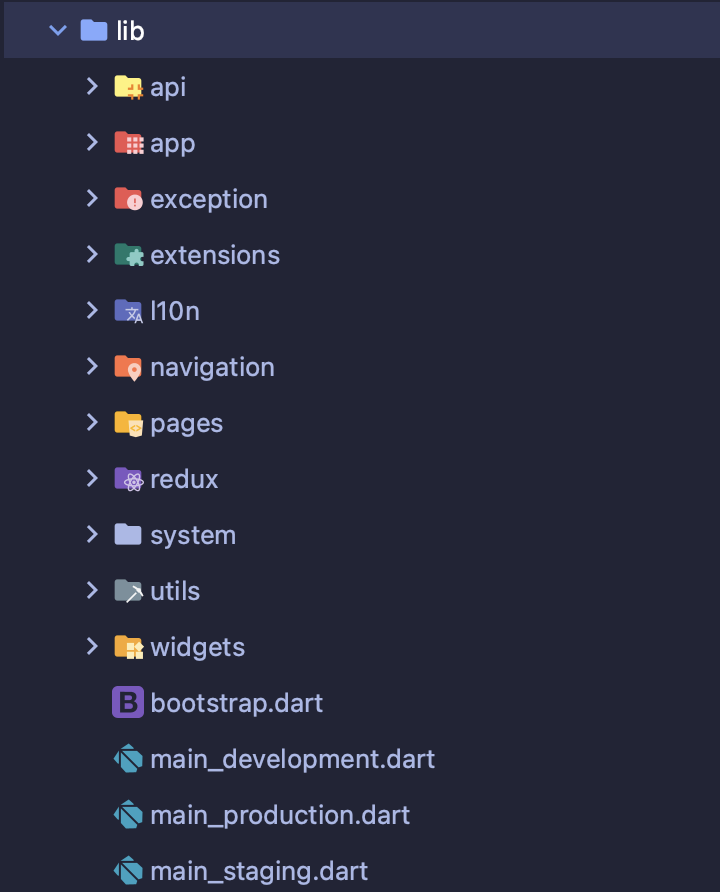
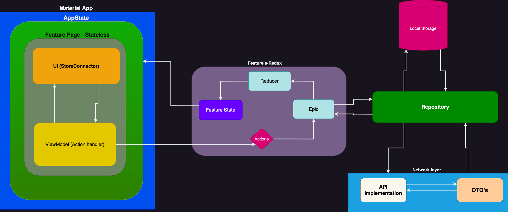

# Stars

The purpose of this repository to share the idea of how to structuring the application
in a nice way.
In my opinion, flutter_redux and redux_epics is a great combination to setup base for
flutter application.

## Getting Started 🚀

This project contains 3 flavors:

- development
- staging
- production

To run the desired flavor either use the launch configuration in VSCode/Android Studio or use the
following commands:

```sh
# Development
$ flutter run --flavor development --target lib/main_development.dart

# Staging
$ flutter run --flavor staging --target lib/main_staging.dart

# Production
$ flutter run --flavor production --target lib/main_production.dart
```

_\*Stars works on iOS, Android, and Web._

> Note:  You can have a look in [flutter_redux](https://pub.dev/packages/flutter_redux),
> and [redux_epics](https://pub.dev/packages/redux_epics).

[Nihad Delic](https://nihad-delic91.medium.com) also wrote a small application to understand how to use `flutter_redux`
with `redux_epics` in the following
URL [Redux and epics for better-organized code in Flutter apps](https://nihad-delic91.medium.com/reduce-duplication-achieve-flexibility-means-success-for-the-flutter-app-e5e432839e61).
> This structure already listed on Flutter's
> official [State management list](https://docs.flutter.dev/development/data-and-backend/state-mgmt/options#redux) page.

---

## Structure and architecture explanation:

By utilizing Flutter Redux as a global application state management tool and Redux Epics for stream handling, you can
recycle your Dart code.

When starting a new project, it's common to consider which architecture and structure to follow. With so many state
management options available, it’s a bit challenging to pick one and you may be seeking a solution that is
not only reusable but can also accommodate future product expansion.


I’m going to explain the structure I have been following and how it helped me to manage the state of the application
in a better way.

---

### App Structure

The directory structure with their responsibilities are mentioned below:


### 1. Api/Repository

1. The API is synonymous with the repository, and we will use the interface to retrieve data from either the network or
   local storage.
2. You have the flexibility to relocate this layer within the package to suit your specific needs.
3. The objects of your data type will be included in the repository.

### 2. App

1. During the App's `initState(){}` method, inject the complete `graph` or modules, and then pass the Store to
   the `StoreProvider`. There is no need for any external injections in this step.
2. Within the application's `build(BuildContext context){}` method, the modules will be transmitted to all the app's
   widgets using a `StoreProvider()`.
3. Throughout the application's life cycle, the App module will monitor all the modules.

### 3. Exception

1. This is the primary way to create any type of exception. It functions as a decorator on the `Exception` and will
   provide an example of `LowPriorityException` for now.

### 4. Extensions

1. All the helper `extensions` will be part of this directory. You can enhance as per your requirement, but you can find
   a
   number of extensions methods.

### 5. Navigation

1. You have the option to define your page's name and then execute the `build runner` command to automatically generate
   the corresponding route.
2. Once the route has been generated, it can be utilized for navigation purposes.

> Note: I opted for Auto_router because it can tackle complicated navigation scenarios. However, you can substitute it
> with any other navigation tool of your choice.

### 6. Pages

1. This is where all the features, pages, screens, and so on, will be located.
2. Every feature will have a corresponding UI and Redux folder that contains its `action`, `epics`, `reducer`,
   and `State`.

   #### How does redux work here?
    - To begin, generate a State class for the corresponding feature. In the current instance, `LaunchesState` will
      contain two objects: the first will record the status of the launches obtained from the API, while the second will
      contain the actual list of launches.
    - Establish an `Action` class in a distinct file and define your actions by expanding from the core Action class (
      outlined in Redux). Actions serve as the events that will be triggered, such
      as `FetchLaunchesAction`, `FetchLaunchesSucceededAction`, `FetchLaunchesFailureAction`.
    - You can create a new file for the `epics` and read/catch your action/event in it. Access the repository and apply
      your business logic. Then, `emit/yield` the next `action/event` (either success or failure). Finally, combine your
      epics in a list and pass them back to the Middleware, which is connected with redux/core.
   > To clarify, the middleware in this context is essentially a list of all the epics for each feature, which functions
   as a middleware.
    - In a new file, create a `reducer` to update the state of the feature based on the Action/Event.
    - Great, now you're all set and can display the data in the user interface!
   > NOTE: In this example, you will see the other classes. Those are decorators to manage the data layer by layer.
3. To receive data via `ViewModel` in the UI, you can use `StoreConnector`.

### 7. Redux

1. An abstract class named `Action` should be created, which will serve as the base class for all child actions/events.
   Additionally, an `ExceptionAction` should be declared as a child of Action, which will serve as the
   parent `exception` action.
2. Next, create an `AppState` class that includes the initial values. This class should contain a factory method that
   maintains the initial state for all features. To update the state, include a `copyWith()` method.
3. The app's core must be constructed, which involves creating a `Store` and injecting the `initialState()` of the app.
   The Store also needs to receive the `Middleware` of the app in the form of epics, as well as a reducer to identify
   the actions/events.
   > Hint: Here, you can establish your logout process without any boilerplate code.
4. Create a `reducer` to manage the actions that are related to the system's core.
5. Define a `DataState` class which can indicate the status of an object, such as `loaded`, `loading`, `failure`, etc.
   This DataState will be utilized in the application to track the state of the corresponding object.

### 8. System

1. Create app life cycle actions and their corresponding `observers`, along with business logic to handle object changes
   during the life cycle.
2. The module `initializer` needs to be set up in this architecture. It involves a list of modules that includes the
   initialization of `Dio`, `Repository`, `Environment`, `Local Storage`, and so on.
3. To build the values for the list of modules, create a `Graph` of the Module objects, which can be accomplished using
   the [built_value](https://pub.dev/packages/built_value) package. Additionally, in this example, an abstract class has
   been included with a `dispose()` method that can be used to close all connections of the initialized objects.
4. In a separate initializer file, create a method named `initialize()` to set up the `graph` by providing the necessary
   values.
5. You can use the `FutureBuilder()` in the main file to `asynchronously` receive the initialized graph. This allows you
   to display a splash page while the app/graph is being prepared.
6. To make high level values accessible throughout the app, use `InheritedWidget` to create an `InjectorWidget`
   for `dependency injection` via the context.

### 9. Utils

1. This directory will contain utility functions and classes that can be useful in organizing the app.

### 10. Widgets

1. You can put your commonly used widgets in this directory, which can be accessed and utilized throughout the app. If
   needed, you can also move them to a separate layer or package for more organization.

### 11. Main

1. Set up your `router`'s initialization here.
2. Build a `graph` while initializing the modules list.
3. During initializing, make sure to show your splash page.
4. At this point, you don’t have the `MaterialApp()` access, and you can use `Directionality` widget to present
   the SplashScreen
5. Once `Graph` is ready, switch the UI with your `FutureBuilder()`'s builder method.

---

### Low level diagram



### Testing

- Tests are under development and will try my best to cover 99%

### Libraries

- [Auto route](https://pub.dev/packages/auto_route)
- [Dio](https://pub.dev/packages/dio)
- [Equatable](https://pub.dev/packages/equatable)
- [Flutter redux](https://pub.dev/packages/flutter_redux)
- [Helper options](https://pub.dev/packages/helper_options)
- [Json annotation](https://pub.dev/packages/json_annotation)
- [Redux epics](https://pub.dev/packages/redux_epics)
- 